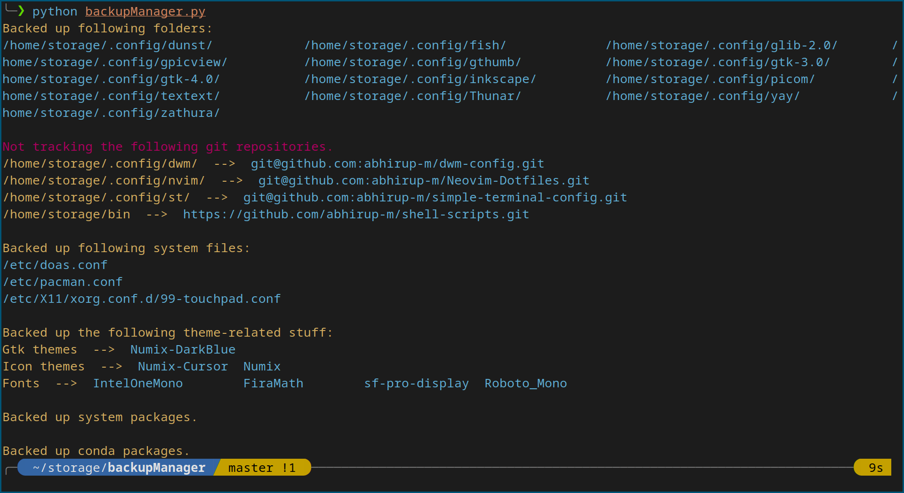

# Backup Manager
*Very simple python script for backing up dotfiles and other configuration files*



# Features
- Specify full paths of files that you want backed up in **sources.json**
- Run backupManager.py; it copies these folders into a backup folder created within the repository.
- Also works for system files (such as pacman.conf, doas.conf, etc), as long as you specify the paths properly.
- Additionally, creates list of gtk themes, icon themes and fonts stored in specified folders (~/.themes, ~/.icons etc).
- Backs up conda environment, if path to conda binary is provided.

Everything must be specified in sources.json. An example is shown below.
```
{
	"dotfiles": [
		"/home/storage/.config/dunst/",
  		"/home/storage/.config/dwm/",
  		"/home/storage/.config/fish/",
  		"/home/storage/.config/glib-2.0/",
  		"/home/storage/.config/gpicview/",
  		"/home/storage/.config/gthumb/",
  		"/home/storage/.config/gtk-3.0/",
  		"/home/storage/.config/gtk-4.0/",
  		"/home/storage/.config/inkscape/",
  		"/home/storage/.config/nvim/",
  		"/home/storage/.config/picom/",
  		"/home/storage/.config/st/",
  		"/home/storage/.config/textext/",
  		"/home/storage/.config/Thunar/",
  		"/home/storage/.config/yay/",
  		"/home/storage/.config/zathura/",
		"/home/storage/bin"
	],
	"system-files": [
		"/etc/doas.conf",
  		"/etc/pacman.conf",
  		"/etc/X11/xorg.conf.d/99-touchpad.conf"
	],
	"themes": "/home/storage/.themes",
	"icons": "/home/storage/.icons",
	"fonts": "/home/storage/.fonts",
	"packages": "pacman -Qqe",
	"conda": "/home/storage/miniconda3/bin/conda"
}
```
